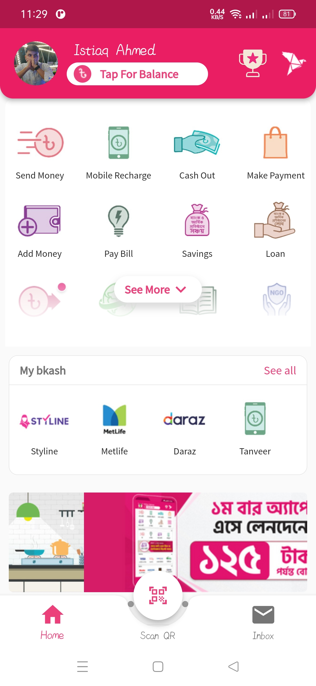
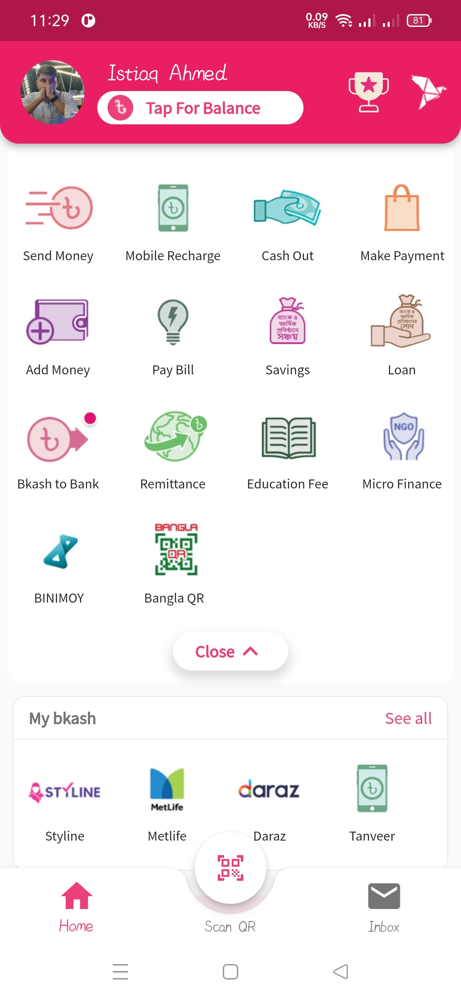
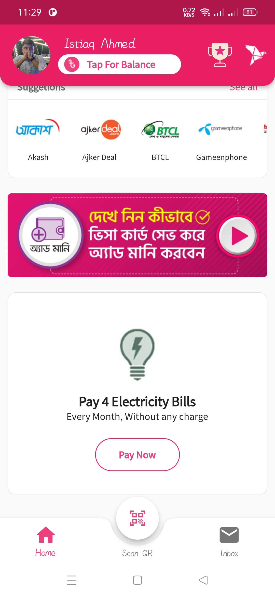
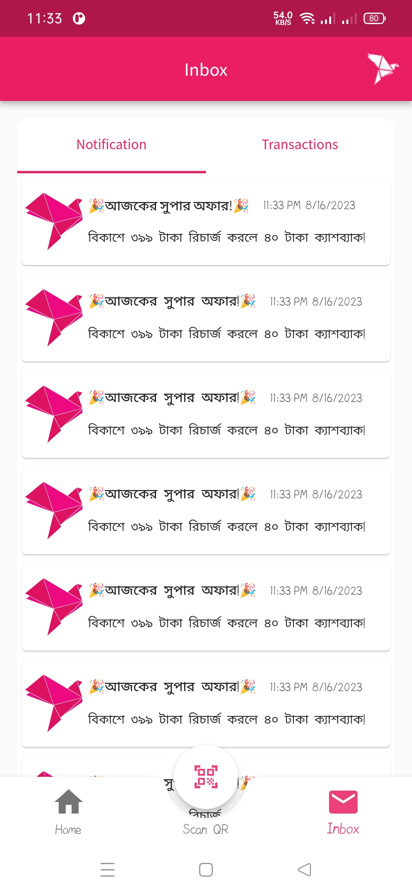
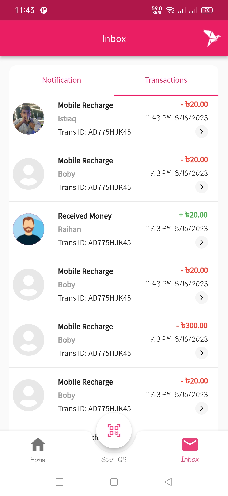
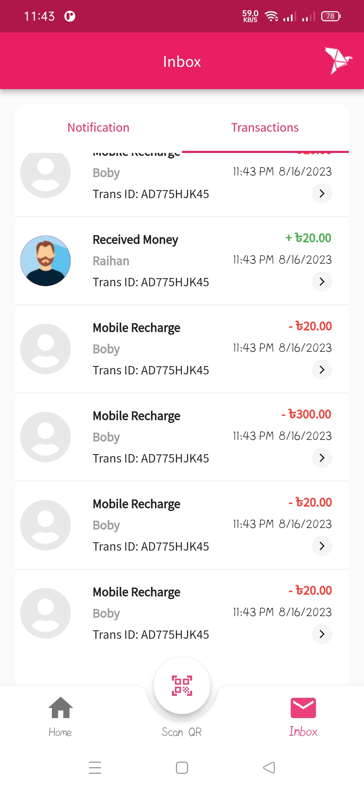

# bkash_ui

## [Run App](https://github.com/Istiaq66/MentorShip/blob/master/bkash_ui/app-release.apk)

## Appbar

If your appbar has a lot of widgets then use custom appbar. Use the title property of the appbar to customize the 
Appbar widget to your liking.

## Gridview custom

When making a custom list like structure If you face any renderflex error you have to use expanded widget for all the elements in that particular row or column or else if won't work. So we should make a custom widget so that we can put the expanded widget on top of that custom widget. Thus renderflex is solved.

## The Notch Issue

The notch was showing the background colors of the Scafold so I used Scaffold--> extendBody: true,(If true, and [bottomNavigationBar] or [persistentFooterButtons] is specified, then the [body] extends to the bottom of the Scaffold, instead of only extending to the top of the [bottomNavigationBar] or the [persistentFooterButtons].)
which made my notch background transparent. 

### Why this worked 
In Flutter, a Scaffold widget provides a framework for building pages with various standard app features like an app bar, a floating action button (FAB), and a bottom navigation bar. By default, the body content of the Scaffold does not extend behind the app bar and the bottom navigation bar. This means that these components have their own dedicated spaces, and the body content is positioned between them.

When you set extendBody: true in a Scaffold, you are essentially allowing the body content to extend behind the app bar and the bottom navigation bar. This can be especially useful in scenarios where you want to create a more immersive design, such as having a background image or color that spans the entire screen, including behind these app bars and navigation bars.

### How to solve text overflow issues?

In my app I faced a issue during design of text widgets in inbox section for different screen sizes which can produce overflow error 

## Final Result

|  |  |  |  |  |  |  |
|:----------------------:|:----------------------:|:----------------------:|:----------------------:|:----------------------:|:----------------------:|:----------------------:|

## Demo video of this project-->

